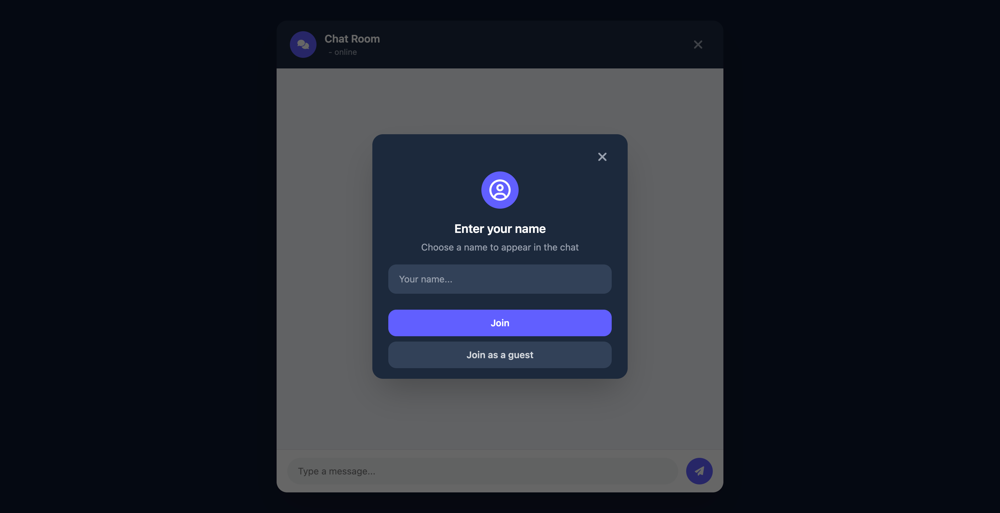
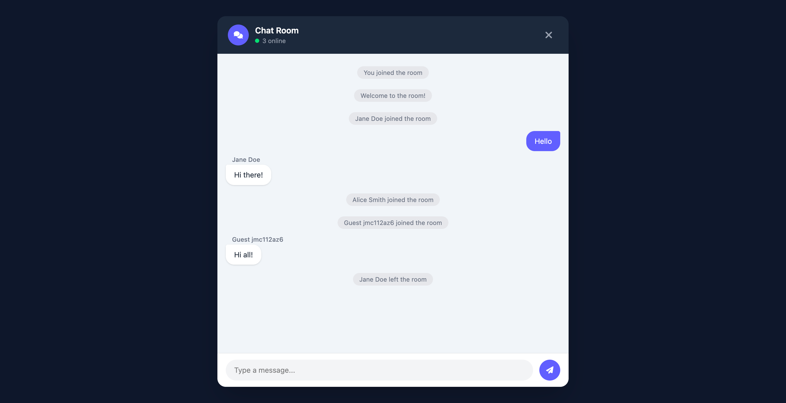
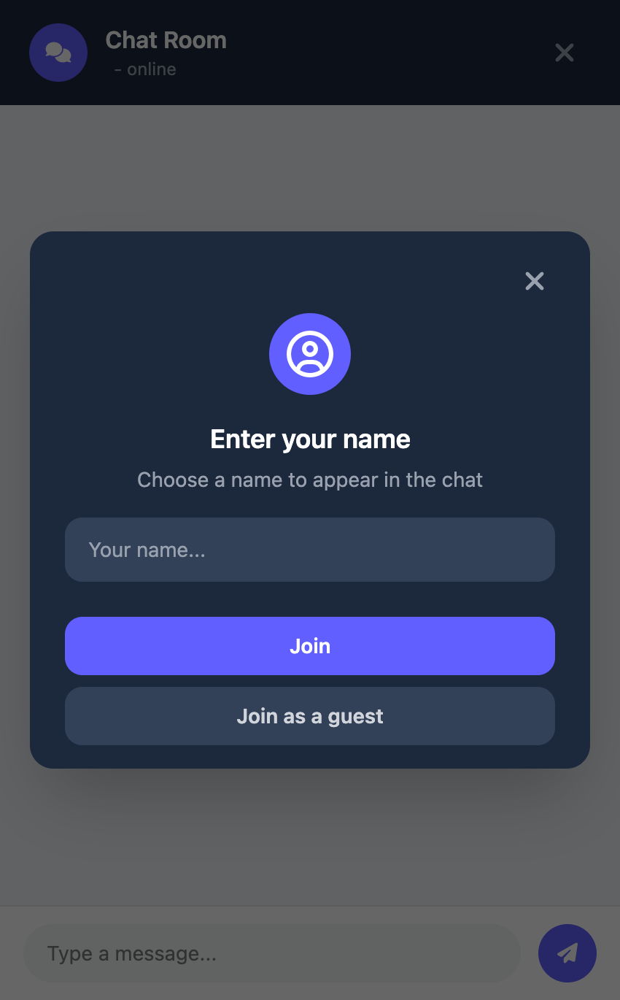
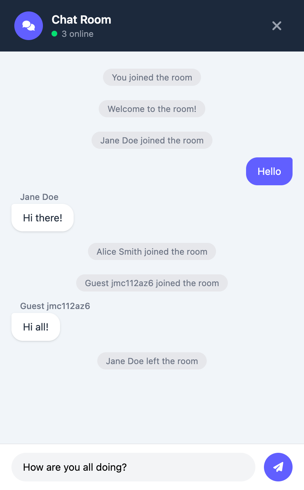

# ChatRoom - Chat App

[](LICENSE)
[](https://nodejs.org/)

> A lightweight, real-time chat application built with vanilla JavaScript, Node.js, and WebSockets.

---

## Table of Contents

- [Overview](#overview)
- [Features](#features)
- [Screenshots](#screenshots)
- [Architecture](#architecture)
- [Tech Stack](#tech-stack)
- [Getting Started](#getting-started)
  - [Prerequisites](#prerequisites)
  - [Installation](#installation)
  - [Running Locally](#running-locally)
- [Project Structure](#project-structure)
- [Configuration](#configuration)
- [License](#license)

---

## Overview

Chat Room is a minimalist real-time messaging platform that lets users join a shared chat under a custom username or as an anonymous guest. All communication happens over WebSockets — no page reloads, no polling.

---

## Features

- **Real-time messaging** — bidirectional WebSocket communication with zero latency overhead
- **Flexible identity** — join with a custom display name (up to 50 characters) or instantly as a guest
- **Live presence** — online user count updated in real time as users join and leave
- **Connection status indicator** — visual badge reflecting the current WebSocket connection state
- **Join / leave notifications** — system messages announce when participants enter or exit the room
- **Input validation** — name capped at 50 characters, messages capped at 500 characters
- **Responsive layout** — works on mobile and desktop viewports

---

## Screenshots

### Web

| Name Entry | Chat Room |
|---|---|
|  |  |

---

### Mobile

| Name Entry | Chat Room |
|---|---|
|  |  |

---

## Architecture

```
Browser (client/)
    │
    │  WebSocket (ws://)
    ▼
Node.js + Express (server/)
    │
    │  In-memory client Map
    ▼
Broadcast to all connected peers
```

The server maintains a `Map<WebSocket, clientData>` for active sessions. Every inbound message is parsed, stamped with metadata, and broadcast to all peers with an `isSelf` flag so each client can style its own messages distinctly. There is no database layer — messages are ephemeral.

**WebSocket message types**

| Type | Direction | Description |
|---|---|---|
| `NAME` | Client → Server | User submits their chosen display name |
| `MESSAGE` | Client → Server | User sends a chat message |
| `WELCOME` | Server → Client | Server greeting sent to the joining user |
| `JOIN` | Server → All | Notifies room that a new user joined |
| `LEAVE` | Server → All | Notifies room that a user left |
| `ONLINE_COUNT` | Server → All | Updated participant count |

---

## Tech Stack

| Layer | Technology |
|---|---|
| Frontend | HTML5, Vanilla JavaScript, Tailwind v4 |
| Icons | Font Awesome v6 (CDN) |
| Backend | Node.js, Express v5 |
| WebSocket | `ws` v8 |
| Dev tooling | Nodemon, PostCSS, Autoprefixer |

---

## Getting Started

### Prerequisites

- **Node.js** 18 or later
- **npm** 9 or later

### Installation

```bash
git clone https://github.com/yitmeng00/chat-room.git
cd chat-room

# Install client dependencies and build CSS
cd client
npm install
npm run build:css

# Install server dependencies
cd ../server
npm install
```

### Running Locally

```bash
# In one terminal — start the server
cd server
npm run dev      # auto-restarts via nodemon

# Then open client/index.html directly in your browser
```

The server listens on `http://localhost:3000` by default. The WebSocket endpoint is exposed at `ws://localhost:3000`.

---

## Project Structure

```
chat-room/
├── client/
│   ├── index.html          # Application shell
│   ├── client.js           # WebSocket client logic and DOM rendering
│   ├── src/
│   │   └── input.css       # TailwindCSS entry point
│   ├── dist/
│   │   └── output.css      # Compiled stylesheet (git-ignored)
│   └── postcss.config.js
├── server/
│   └── server.js           # Express + WebSocket server
├── docs/
│   └── screenshots/        # README screenshots
├── LICENSE
└── README.md
```

---

## Configuration

| Variable | Default | Description |
|---|---|---|
| `PORT` | `3000` | Port the Express / WebSocket server binds to |

Set the variable in your shell or a `.env` file before starting the server:

```bash
PORT=8080 npm run dev
```

---

## License

This project is licensed under the [MIT License](LICENSE).
